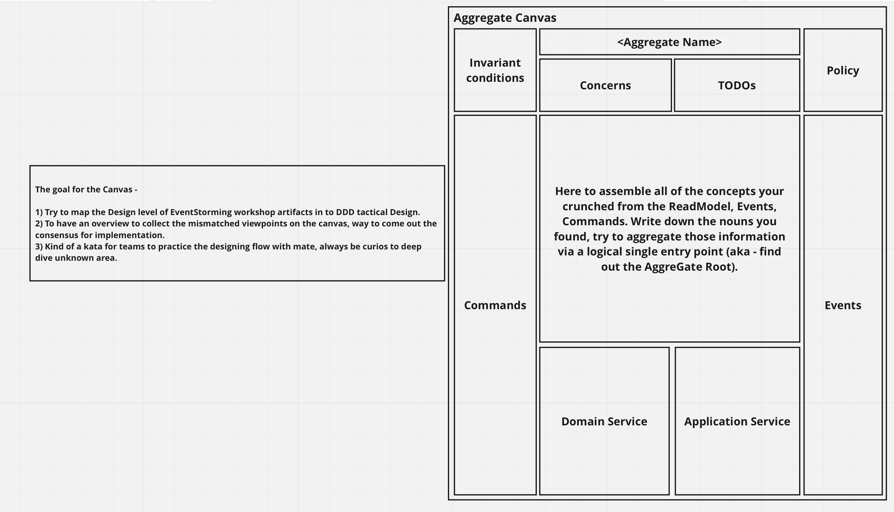

# aggregate-canvas
Aggregate Canvas is a tool for developers in designing solutions through EventStorming 3rd level (software design) modeling artifacts to come out DDD tactical design objects. Provides a simpler reference to map the ES artifacts into design.

## Fit in the ES artifacts into the Aggregate Canvas

Using the template Miro board to have an overview.

## Further activities
